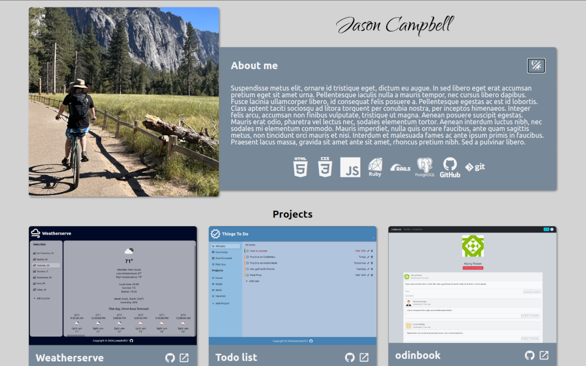
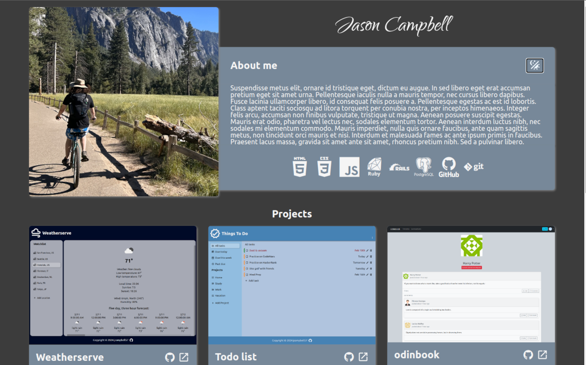
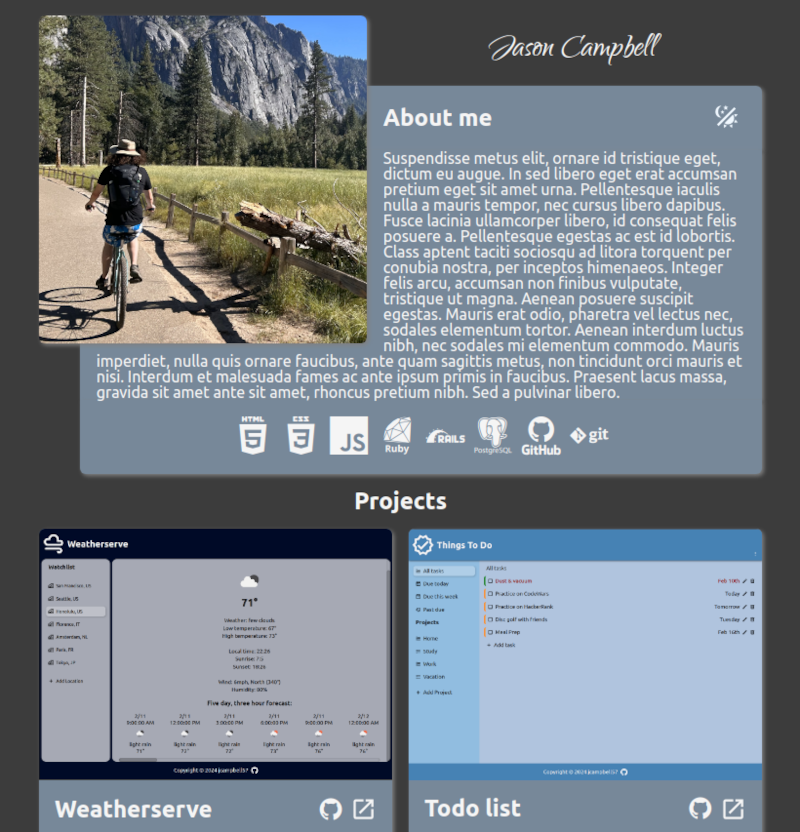
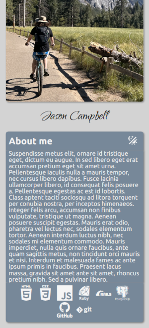

# odin-homepage

## Project info

The goal of this prohject was to create a responsive homepage that looks acceptable at any screen size, like you might find on a portfolio site. Project description can be found here:

https://www.theodinproject.com/lessons/advanced-html-and-css-homepage

## Features

- responsive layout for mobile
- responsive project card layout
- responsive portrait image resolution
- responsive portrait image size
- dark mode

## Photos

### Full layout:

 

### Dark layout:

 

### Tablet layout:

 

### Phone layout:

 

## Resources

https://www.w3.org/WAI/tutorials/page-structure/regions/
- I used this resource to make sure the page regions were set up for accessibility.

https://developer.mozilla.org/en-US/docs/Learn/HTML/Multimedia_and_embedding/Responsive_images
- This resource was helpful when setting up responsive images.

https://www.geeksforgeeks.org/how-to-wrap-the-text-around-an-image-using-html-and-css/
- I refered to this resource when setting up text to wrap around an image.

https://css-tricks.com/snippets/css/a-guide-to-flexbox/
- This flexbox resource came in handy at least once

## Improvements

- possible header with contact links and theme toggle
- Card links like this on hover:
  - https://darknab.github.io/Portfolio/#contact
